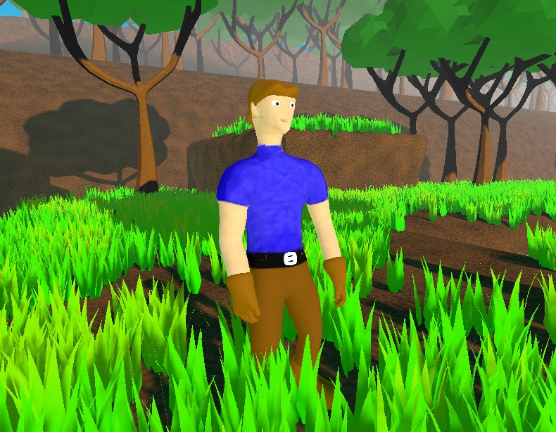
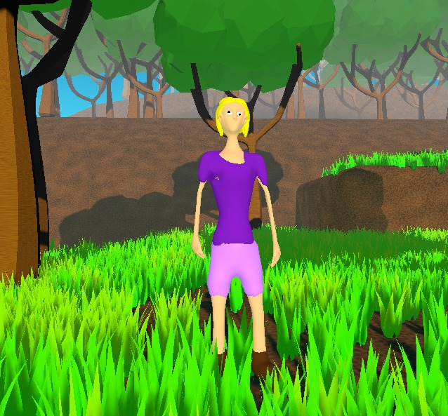
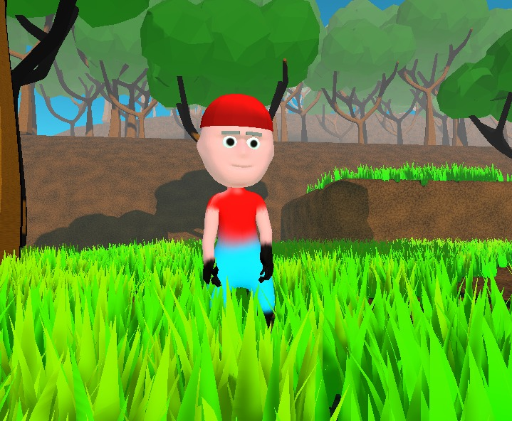
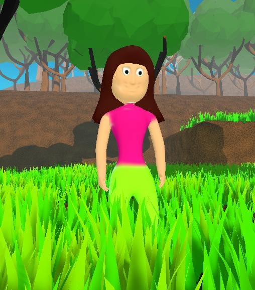
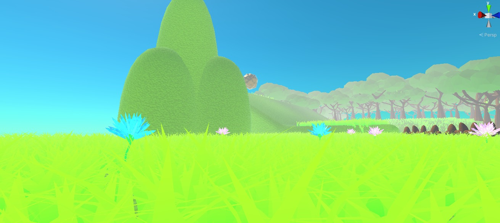
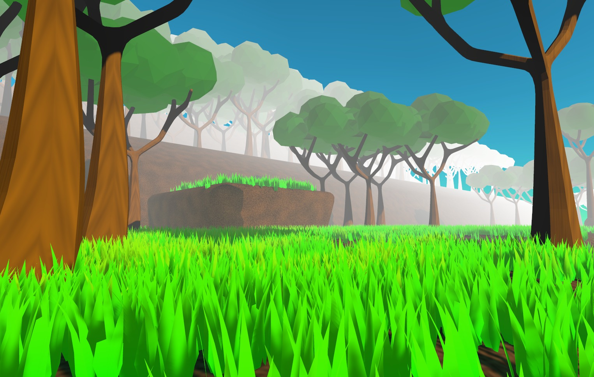
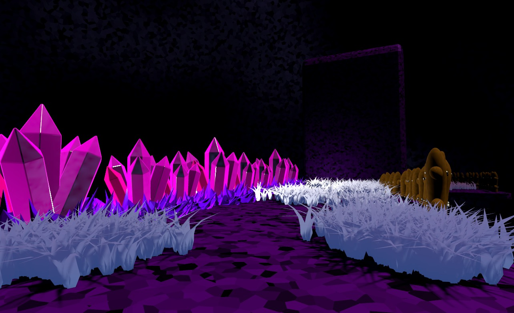
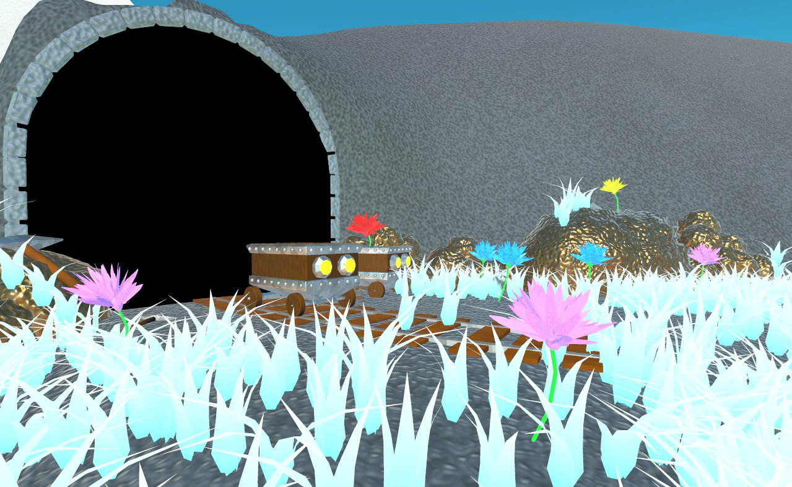
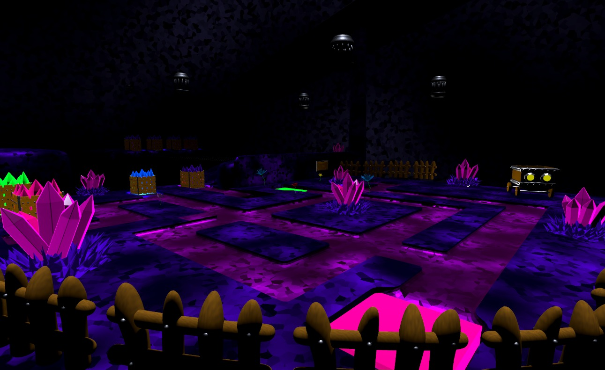
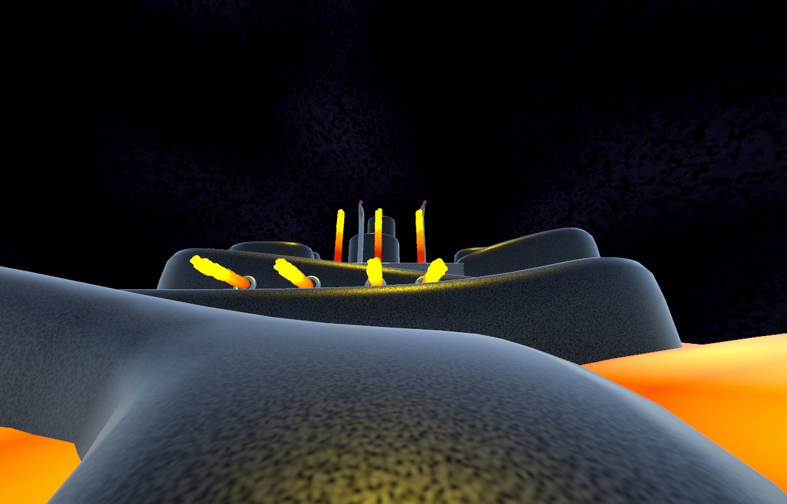

# Super Rumpy 3D

This Project is a 3D local Multiplayer Plattformer, made with Unity.

itch.io link: https://maxi1324.itch.io/superrumpy3d

- Motivation
- Description
- Learnings
- Controls
- External Tools

## Motivation
This Project was made for School. In School there is a lesson called PRE. There we learn how to Manage Projects. In the course of this, this Project was made.

## Description
This game is 3D local multiplayer Jump and run. 
 
 
The Player can walk, run and jump arround.  
During the Game, the Player unlocks new Movement abilities like the Grappling Hook, the Long Jump and the High Jump.

There are four Skins the player can choose from

|        Rumpy         |        Rumpina         |          Joe           |          Mama          |
| :------------------: | :--------------------: | :--------------------: | :--------------------: |
|  |  |  |  |

 
This game contains 5 individual Levels. Each level has a unique Design and a unique Gameplay.

|Gras Level| Forest Level|
|:------------------:|:------------------:|
| ||

|Cave Level|Mountain Level|
|:------------------:|:------------------:|
| ||

|Mountain Subarea| Laval Level|
|:------------------:|:------------------:|
| ||

This Game has a fantastic story, which is told by the amazing CutScenes between the levels.

Rumpy and his family is going for a walk. They are happy. After a few minutes they recognize, their baby is gone. So they decide to search for the baby. 

If you want to hear the full Story, play the game!

# Controls

To play this game, you need a XInput Controller.

- Left Stick: Move arround
- A: Jump
- X: Run
- Z(Bumper) hold: Switch to High and Long Jump mode
  
In oder to perform a LongJump, run hold the Z(Bumper) Button and Jump

In oder to perform a HighJump, stand still hold the Z(Bumper) Button and Jump

# Learnings
- Project Management(all the documents)
- Expect that the other developers are dumb.
- Bigger Teams are more difficult to manage.
- Do smaller Projects for school!
- Assess the effort for creating a Project like this.
- improved Game development Skills

# External Tools 
- Blender
- Unity
- Krita
- Github 
- Desktop
- 3D Noise: https://github.com/JimmyCushnie/Noisy-Nodes
- GrasShader + Tool: Minios Art https://www.patreon.com/posts/grass-geometry-2-40077798
- Example Partikel Effects: Unity 
- Beautiful Progress Bar Free Loadingbars: https://assetstore.unity.com/packages/2d/gui/icons/beautiful-progress-bar-free-194904
- Clean Vector Icons:https://assetstore.unity.com/packages/2d/gui/icons/clean-vector-icons-132084
- EasyFPSCounter: https://assetstore.unity.com/packages/tools/integration/easy-fps-counter-130203